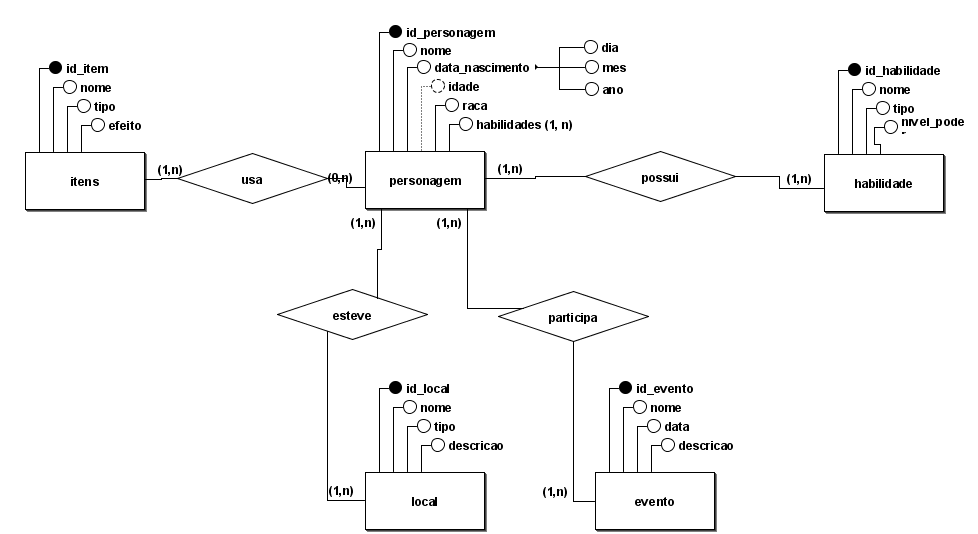
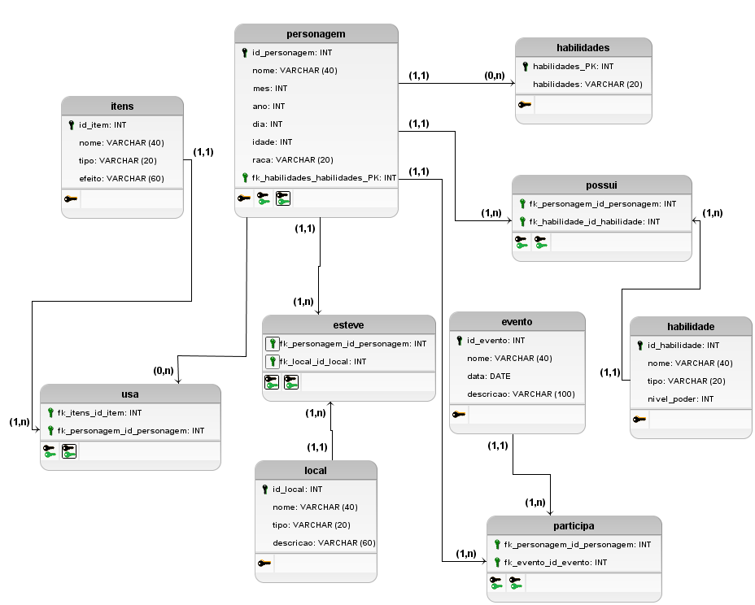

# 1 - Cenário

 O sistema de banco de dados para "Slime Datta Ken" gerencia entidades como casas (id_casa - número, bairro, rua), personagens (id_personagem - nome, data de nascimento, raça, idade), habilidades (id_habilidade - nome, tipo, nível de poder), itens (id_item - nome, tipo, efeito), locais (id_local - nome, tipo, descrição), eventos (id_evento - nome, data, descrição) e e-mails (id_email - endereço de e-mail). Cada entidade possui atributos específicos, como número e localização para casas, nome e raça para personagens, e nome e efeito para itens. Relacionamentos são estabelecidos, como a residência de um personagem em uma casa, a posse de habilidades e itens por parte dos personagens, e a participação em eventos. Essa estrutura permite um acompanhamento detalhado das interações entre os elementos do universo de "Slime Datta Ken", garantindo uma experiência coesa e imersiva para os usuários.

# 2 - Modelagem Conceitual


# 3 - Modelagem Lógica


# 4 - Modelagem Física
### Criação do banco `SlimeDatta`
```sql
CREATE DATABASE SlimeDatta;
USE SlimeDatta;
```

### Criação da tabela `casa`
```sql
CREATE TABLE casa (
  id_casa            INT             IDENTITY	 PRIMARY KEY,
  numero             INT			 NOT NULL,
  bairro             VARCHAR(40),
  rua                VARCHAR(60)
);
```

### Criação da tabela `personagem`
```sql
CREATE TABLE personagem (
  id_personagem      INT             IDENTITY    PRIMARY KEY,
  nome               VARCHAR(100),
  data_nascimento    DATE,
  raca               VARCHAR(100),
  id_casa            INT			 FOREIGN KEY REFERENCES casa(id_casa),
  idade              AS DATEDIFF(YEAR, data_nascimento, GETDATE())
);
```

### Criação da tabela `registro`
```sql
CREATE TABLE registro (
  id_registro        INT             IDENTITY	 PRIMARY KEY,
  numero_registro    INT,
  id_personagem      INT             UNIQUE,
  FOREIGN KEY (id_personagem) REFERENCES personagem(id_personagem)
);
```

### Criação da tabela `habilidade`
```sql
CREATE TABLE habilidade (
  id_habilidade      INT             IDENTITY    PRIMARY KEY,
  nome               VARCHAR(40),
  tipo               VARCHAR(20),
  nivel_poder        INT
);
```

### Criação da tabela `item`
```sql
CREATE TABLE item (
  id_item            INT             IDENTITY    PRIMARY KEY,
  nome               VARCHAR(40),
  tipo               VARCHAR(20),
  efeito             VARCHAR(60)
);
```

### Criação da tabela `local`
```sql
CREATE TABLE local (
  id_local           INT             IDENTITY    PRIMARY KEY,
  nome               VARCHAR(40),
  tipo               VARCHAR(20),
  descricao          VARCHAR(60)
);
```

### Criação da tabela `evento`
```sql
CREATE TABLE evento (
  id_evento          INT             IDENTITY    PRIMARY KEY,
  nome               VARCHAR(40),
  data               DATE,
  descricao          VARCHAR(60)
);
```

### Criação da tabela `email`
```sql
CREATE TABLE email (
  id_email           INT             IDENTITY    PRIMARY KEY,
  id_personagem      INT,
  endereco_email     VARCHAR(255),
  FOREIGN KEY (id_personagem) REFERENCES personagem(id_personagem)
);
```

### Criação da tabela `possui`
```sql
CREATE TABLE possui (
  id_personagem      INT,
  id_habilidade      INT,
  PRIMARY KEY (id_personagem, id_habilidade),
  FOREIGN KEY (id_personagem) REFERENCES personagem(id_personagem),
  FOREIGN KEY (id_habilidade) REFERENCES habilidade(id_habilidade)
);
```

### Criação da tabela `usa`
```sql
CREATE TABLE usa (
  id_personagem      INT,
  id_item            INT,
  PRIMARY KEY (id_personagem, id_item),
  FOREIGN KEY (id_personagem) REFERENCES personagem(id_personagem),
  FOREIGN KEY (id_item) REFERENCES item(id_item)
);
```

### Criação da tabela `esteve`
```sql
CREATE TABLE esteve (
  id_personagem      INT,
  id_local           INT,
  PRIMARY KEY (id_personagem, id_local),
  FOREIGN KEY (id_personagem) REFERENCES personagem(id_personagem),
  FOREIGN KEY (id_local) REFERENCES local(id_local)
);
```

### Criação da tabela `participa`
```sql
CREATE TABLE participa (
  id_personagem      INT,
  id_evento          INT,
  PRIMARY KEY (id_personagem, id_evento),
  FOREIGN KEY (id_personagem) REFERENCES personagem(id_personagem),
  FOREIGN KEY (id_evento) REFERENCES evento(id_evento)
);
```

# 5 - Inserção de Dados
### Inserção de dados na tabela `casa`
```sql
INSERT INTO casa (numero, bairro, rua) VALUES
(1, 'Bairro A', 'Rua Principal'),
(2, 'Bairro B', 'Rua Secundária'),
(3, 'Bairro C', 'Avenida Central'),
(4, 'Bairro D', 'Avenida dos Sonhos'),
(5, 'Bairro E', 'Rua da Harmonia'),
(6, 'Bairro F', 'Avenida das Flores'),
(7, 'Bairro G', 'Rua da Paz'),
(8, 'Bairro H', 'Avenida da Liberdade'),
(9, 'Bairro I', 'Rua do Sol'),
(10, 'Bairro J', 'Avenida da Esperança'),
(11, 'Bairro K', 'Rua da Alegria'),
(12, 'Bairro L', 'Avenida da Amizade'),
(13, 'Bairro M', 'Rua da Felicidade'),
(14, 'Bairro N', 'Avenida da Serenidade'),
(15, 'Bairro O', 'Rua das Estrelas'),
(16, 'Bairro P', 'Avenida do Amor'),
(17, 'Bairro Q', 'Rua da Harmonia'),
(18, 'Bairro R', 'Avenida da Aventura'),
(19, 'Bairro S', 'Rua do Destino'),
(20, 'Bairro T', 'Avenida da Magia');
```

### Inserção de dados na tabela `personagem`
```sql
INSERT INTO personagem (nome, data_nascimento, raca, id_casa) VALUES
('Rimuru Tempest', '1990-01-01', 'Slime', 1),
('Shion', '1995-03-15', 'Oni', 2),
('Benimaru', '1992-07-20', 'Kijin', 3),
('Shuna', '1993-05-10', 'Kijin', 4),
('Gobta', '2000-11-30', 'Goblin', 5),
('Milim Nava', '1985-09-25', 'Demon Lord', 6),
('Souei', '1991-12-05', 'Kijin', 7),
('Diablo', '1993-02-20', 'Demon', 8),
('Ranga', '1998-08-10', 'Wolf', 9),
('Gabiru', '1997-04-18', 'Lizardman', 10),
('Rigurd', '1988-06-30', 'Dwarf', 11),
('Treyni', '1990-10-22', 'Dryad', 12),
('Geld', '1994-11-15', 'Orc', 13),
('Clayman', '1987-03-07', 'Unknown', 14),
('Carrera', '1999-01-25', 'Harpy', 15),
('Grucius', '1996-07-12', 'Ogre', 16),
('Gabil', '1992-04-05', 'Goblin', 17),
('Hakurou', '1989-12-20', 'Kijin', 18),
('Souka', '2002-05-28', 'Elf', 19),
('Gale Gibson', '1997-08-17', 'Human', 20);
```

### Inserção de dados na tabela `registro`
```sql
INSERT INTO registro (numero_registro, id_personagem) VALUES
(1001, 1),
(1002, 2),
(1003, 3),
(1004, 4),
(1005, 5),
(1006, 6),
(1007, 7),
(1008, 8),
(1009, 9),
(1010, 10),
(1011, 11),
(1012, 12),
(1013, 13),
(1014, 14),
(1015, 15),
(1016, 16),
(1017, 17),
(1018, 18),
(1019, 19),
(1020, 20);
```

### Inserção de dados na tabela `habilidade`
```sql
INSERT INTO habilidade (nome, tipo, nivel_poder) VALUES
('Transformação', 'Ativa', 10),
('Explosão de Fogo', 'Ativa', 8),
('Curandeirismo', 'Passiva', 7),
('Telecinese', 'Ativa', 9),
('Furtividade', 'Passiva', 2),
('Voo', 'Ativa', 9),
('Teletransporte', 'Ativa', 8),
('Ilusão', 'Ativa', 7),
('Cura em Massa', 'Ativa', 4),
('Invisibilidade', 'Ativa', 4),
('Força Sobrenatural', 'Ativa', 10),
('Manipulação de Energia', 'Ativa', 9),
('Aura de Proteção', 'Passiva', 7),
('Controle Mental', 'Ativa', 8),
('Evasão', 'Passiva', 6),
('Regeneração Rápida', 'Passiva', 9),
('Explosão de Gelo', 'Ativa', 8),
('Telepatia', 'Ativa', 7),
('Escudo Mágico', 'Ativa', 2),
('Rajada de Vento', 'Ativa', 8);
```

### Inserção de dados na tabela `item`
```sql
INSERT INTO item (nome, tipo, efeito) VALUES
('Espada Longa', 'Arma', 'Aumenta o dano de ataque'),
('Poção de Cura', 'Consumível', 'Recupera pontos de vida'),
('Anel de Proteção', 'Acessório', 'Aumenta a defesa'),
('Arco e Flecha', 'Arma', 'Permite ataques à distância'),
('Amuleto de Sorte', 'Acessório', 'Aumenta a chance de acerto crítico'),
('Varinha Mágica', 'Arma', 'Permite lançar feitiços'),
('Elixir de Força', 'Consumível', 'Aumenta temporariamente a força'),
('Bracelete da Agilidade', 'Acessório', 'Aumenta a velocidade de movimento'),
('Talismã de Proteção', 'Acessório', 'Reduz o dano recebido'),
('Adaga Envenenada', 'Arma', 'Causa dano e envenena o alvo'),
('Elmo de Resistência', 'Acessório', 'Aumenta a resistência a ataques físicos'),
('Orbe de Energia', 'Consumível', 'Recupera pontos de mana'),
('Botas de Fuga', 'Acessório', 'Permite escapar de batalhas'),
('Luvas da Destreza', 'Acessório', 'Aumenta a precisão dos ataques'),
('Cajado Arcano', 'Arma', 'Aumenta o poder mágico'),
('Poção de Invisibilidade', 'Consumível', 'Torna o usuário invisível por um curto período'),
('Pergaminho de Teleporte', 'Consumível', 'Permite teletransporte para um local conhecido'),
('Anel de Regeneração', 'Acessório', 'Acelera a regeneração de ferimentos'),
('Manto da Camuflagem', 'Acessório', 'Permite camuflagem natural em ambientes'),
('Poção de Força', 'Consumível', 'Aumenta temporariamente a força física'),
('Espelho da Reflexão', 'Acessório', 'Reflete ataques mágicos de volta ao lançador'),
('Poção de Resistência', 'Consumível', 'Aumenta temporariamente a resistência a status negativos');
```

### Inserção de dados na tabela `local`
```sql
INSERT INTO local (nome, tipo, descricao) VALUES
('Floresta das Fadas', 'Área Natural', 'Lar das fadas e criaturas mágicas'),
('Cidade dos Goblins', 'Área Urbana', 'Centro de comércio goblin'),
('Montanha Flamejante', 'Área Natural', 'Reino do dragão de fogo'),
('Vila dos Humanos', 'Área Urbana', 'Comunidade pacífica de humanos'),
('Torre do Feiticeiro', 'Área Mística', 'Local de aprendizado de magia arcana'),
('Planície dos Elfos', 'Área Natural', 'Habitat dos elfos e seres da floresta'),
('Caverna dos Trolls', 'Área Natural', 'Terra natal dos trolls e criaturas subterrâneas'),
('Ilha dos Piratas', 'Área Costeira', 'Esconderijo de piratas e saqueadores'),
('Castelo dos Reis', 'Área Urbana', 'Residência dos reis e nobres'),
('Templo dos Deuses', 'Área Sagrada', 'Local de adoração e rituais religiosos'),
('Deserto dos Escaravelhos', 'Área Natural', 'Região desértica habitada por insetos gigantes'),
('Cidade dos Anões', 'Área Urbana', 'Centro de mineração e forja anã'),
('Pântano dos Espíritos', 'Área Natural', 'Lar de espíritos e criaturas místicas'),
('Colina dos Gigantes', 'Área Natural', 'Território dos gigantes e titãs'),
('Porto dos Mercadores', 'Área Costeira', 'Local de comércio e trocas marítimas'),
('Vale das Sombras', 'Área Natural', 'Região assombrada por espíritos malignos'),
('Cidade dos Magos', 'Área Urbana', 'Academia de magia e estudos arcanos'),
('Cachoeira dos Ninfas', 'Área Natural', 'Refúgio das ninfas e seres aquáticos'),
('Aldeia dos Lobisomens', 'Área Natural', 'Comunidade de lobisomens e metamorfos'),
('Ruínas Antigas', 'Área Histórica', 'Vestígios de civilizações antigas e relíquias');
```

### Inserção de dados na tabela `evento`
```sql
INSERT INTO evento (nome, data, descricao) VALUES
('Festival Anual', '2024-07-15', 'Celebrando a paz entre as raças'),
('Invasão Demoníaca', '2024-09-20', 'Hordas de demônios atacam a cidade'),
('Torneio de Arquearia', '2024-08-10', 'Competição de habilidades com arco e flecha'),
('Concerto da Sinfonia Mágica', '2024-06-25', 'Apresentação de música mágica'),
('Ritual da Primavera', '2024-04-05', 'Cerimônia para trazer prosperidade à terra'),
('Baile Real', '2024-10-30', 'Evento de gala com a realeza'),
('Expedição à Montanha', '2024-05-12', 'Jornada para explorar a Montanha Flamejante'),
('Caçada ao Tesouro', '2024-11-08', 'Busca por tesouros escondidos em toda a região'),
('Cerimônia de Iniciação', '2024-02-18', 'Ritual para novos membros da guilda'),
('Desfile de Moda', '2024-09-05', 'Apresentação das últimas tendências de moda'),
('Festival das Luzes', '2024-12-20', 'Celebração com lanternas e fogos de artifício'),
('Torneio de Combate', '2024-03-10', 'Competição de artes marciais e combate'),
('Exposição de Arte', '2024-08-28', 'Mostra de obras de artistas locais'),
('Leilão de Relíquias', '2024-07-02', 'Venda de itens históricos e mágicos'),
('Concurso de Talentos', '2024-11-15', 'Apresentações variadas de habilidades e talentos'),
('Desafio dos Campeões', '2024-06-10', 'Batalha entre os melhores guerreiros da região'),
('Feira de Artesanato', '2024-04-20', 'Venda de produtos artesanais e feitos à mão'),
('Competição de Cavalos', '2024-10-05', 'Corrida de cavalos e exibição de habilidades equestres'),
('Banquete Real', '2024-12-12', 'Banquete em honra aos heróis da cidade'),
('Festa da Colheita', '2024-09-18', 'Celebrando a abundância da colheita');
```

### Inserção de dados na tabela `email`
```sql
INSERT INTO email (id_personagem, endereco_email) VALUES
(1, 'rimuru@tempest.com'),
(1, 'slime@slime.com'),
(2, 'shion@oni.com'),
(2, 'shionofficial@tempest.com'),
(3, 'benimaru@kijin.com'),
(3, 'beni@tempest.com'),
(4, 'shuna@kijin.com'),
(4, 'shuna@tempest.com'),
(5, 'gobta@goblin.com'),
(5, 'gobta@tempest.com'),
(6, 'milim@demons.com'),
(6, 'milim@nava.com'),
(7, 'souei@kijin.com'),
(7, 'souei@tempest.com'),
(8, 'diablo@demon.com'),
(8, 'diablo@tempest.com'),
(9, 'ranga@wolf.com'),
(9, 'ranga@tempest.com'),
(10, 'gabiru@lizardman.com'),
(10, 'gabiru@tempest.com'),
(11, 'rigurd@dwarf.com'),
(11, 'rigurd@tempest.com'),
(12, 'treyni@dryad.com'),
(12, 'treyni@tempest.com'),
(13, 'geld@orc.com'),
(13, 'geld@tempest.com'),
(14, 'clayman@unknown.com'),
(14, 'clayman@tempest.com'),
(15, 'carrera@harpy.com'),
(15, 'carrera@tempest.com'),
(16, 'grucius@ogre.com'),
(16, 'grucius@tempest.com'),
(17, 'gabil@goblin.com'),
(17, 'gabil@tempest.com'),
(18, 'hakurou@kijin.com'),
(18, 'hakurou@tempest.com'),
(19, 'souka@elf.com'),
(19, 'souka@tempest.com'),
(20, 'gale@human.com'),
(20, 'gale@tempest.com');
```

### Inserção de dados na tabela `possui`
```sql
INSERT INTO possui (id_personagem, id_habilidade) VALUES
(1, 1),
(1, 2),
(1, 3),
(2, 2),
(2, 3),
(3, 1),
(3, 2),
(3, 3),
(4, 1),
(4, 2),
(4, 3),
(5, 1),
(5, 2),
(5, 3),
(6, 1),
(6, 2),
(6, 3),
(7, 1),
(7, 2),
(7, 3),
(8, 1),
(8, 2),
(8, 3),
(9, 1),
(9, 2),
(9, 3),
(10, 1),
(10, 2),
(10, 3),
(11, 1),
(11, 2),
(11, 3),
(12, 1),
(12, 2),
(12, 3),
(13, 1),
(13, 2),
(13, 3),
(14, 1),
(14, 2),
(14, 3),
(15, 1),
(15, 2),
(15, 3),
(16, 1),
(16, 2),
(16, 3),
(17, 1),
(17, 2),
(17, 3),
(18, 1),
(18, 2),
(18, 3),
(19, 1),
(19, 2),
(19, 3),
(20, 1),
(20, 2),
(20, 3);
```

### Inserção de dados na tabela `usa`
```sql
INSERT INTO usa (id_personagem, id_item) VALUES
(1, 1),
(1, 2),
(2, 1),
(2, 2),
(3, 3),
(3, 4),
(4, 5),
(4, 6),
(5, 7),
(5, 8),
(6, 9),
(6, 10),
(7, 1),
(7, 2),
(8, 3),
(8, 4),
(9, 5),
(9, 6),
(10, 7),
(10, 8),
(11, 9),
(11, 10),
(12, 1),
(12, 2),
(13, 3),
(13, 4),
(14, 5),
(14, 6),
(15, 7),
(15, 8),
(16, 9),
(16, 10),
(17, 1),
(17, 2),
(18, 3),
(18, 4),
(19, 5),
(19, 6),
(20, 7),
(20, 8);
```

### Inserção de dados na tabela `esteve`
```sql
INSERT INTO esteve (id_personagem, id_local) VALUES
(1, 1),
(1, 2),
(2, 2),
(2, 3),
(3, 4),
(3, 5),
(4, 6),
(4, 7),
(5, 8),
(5, 9),
(6, 10),
(6, 11),
(7, 12),
(7, 13),
(8, 14),
(8, 15),
(9, 16),
(9, 17),
(10, 18),
(10, 19),
(11, 1),
(11, 2),
(12, 3),
(12, 4),
(13, 5),
(13, 6),
(14, 7),
(14, 8),
(15, 9),
(15, 10),
(16, 11),
(16, 12),
(17, 13),
(17, 14),
(18, 15),
(18, 16),
(19, 17),
(19, 18),
(20, 19),
(20, 20);
```

### Inserção de dados na tabela `participa`
```sql
INSERT INTO participa (id_personagem, id_evento) VALUES
(1, 1),
(1, 2),
(2, 2),
(2, 3),
(3, 4),
(3, 5),
(4, 6),
(4, 7),
(5, 8),
(5, 9),
(6, 10),
(6, 11),
(7, 12),
(7, 13),
(8, 14),
(8, 15),
(9, 16),
(9, 17),
(10, 18),
(10, 19),
(11, 1),
(11, 2),
(12, 3),
(12, 4),
(13, 5),
(13, 6),
(14, 7),
(14, 8),
(15, 9),
(15, 10),
(16, 11),
(16, 12),
(17, 13),
(17, 14),
(18, 15),
(18, 16),
(19, 17),
(19, 18),
(20, 19),
(20, 20);
```

# 6 - CRUD
### Leitura de dados de todos os personagens:
```sql
SELECT * FROM personagem
```


### Inserir um novo personagem:
```sql
INSERT INTO personagem (nome, data_nascimento, raca, id_casa) 
VALUES ('Teste', '2000-01-01', 'Humano', 1);
```

### Leitura de dados de todos os personagens depois da incerção:
```sql
SELECT * FROM personagem
```


### Atualizar o nome do personagem 'Teste' para 'Novo Teste'
```sql
UPDATE personagem SET nome = 'Novo Teste' WHERE nome = 'Teste';
```

### Leitura de dados da atualização
```sql
SELECT * FROM personagem
WHERE nome = 'Novo Teste';
```


### Excluir um personagem:
```sql
DELETE FROM personagem WHERE nome = 'Novo Teste';
```

### Leitura de dados de todos os personagens após a exclusão
```sql
SELECT * FROM personagem;
```


## 7 - Relatórios
### 1. Consulta com Junção entre Personagem e Habilidade
```sql
SELECT p.nome AS Nome_Personagem, h.nome AS Habilidade
FROM personagem p
JOIN possui po ON p.id_personagem = po.id_personagem
JOIN habilidade h ON po.id_habilidade = h.id_habilidade;
```


Explicação: Esta consulta retorna uma lista de personagens e suas respectivas habilidades. Ela junta as tabelas personagem, possui (que liga personagens a habilidades), e habilidade.

### 2. Mostrar os itens utilizados por cada personagem:
```sql
SELECT p.nome AS Nome_Personagem, i.nome AS Item
FROM personagem p
JOIN usa u ON p.id_personagem = u.id_personagem
JOIN item i ON u.id_item = i.id_item;
```

Explicação: Esta consulta exibe os itens que cada personagem utiliza. As tabelas personagem, usa (que liga personagens a itens), e item são unidas para obter essas informações.

### 3. Consulta com Ordenação em Personagem e Evento
```sql
SELECT p.nome AS Nome_Personagem, e.nome AS Evento
FROM personagem p
JOIN participa pa ON p.id_personagem = pa.id_personagem
JOIN evento e ON pa.id_evento = e.id_evento
ORDER BY e.data;
```

Explicação: Esta consulta lista os personagens e os eventos nos quais participam, ordenados pela data dos eventos. Tabelas personagem, participa (que liga personagens a eventos), e evento são unidas para esse propósito. O ORDER BY e.data ordena os resultados pela data do evento.

### 4. Consulta de Personagem com Mais de Uma Habilidade
```sql
SELECT p.nome AS Personagem, COUNT(ph.id_habilidade) AS NumeroDeHabilidades
FROM personagem p
JOIN possui ph ON p.id_personagem = ph.id_personagem
GROUP BY p.nome
HAVING COUNT(ph.id_habilidade) > 1;
```

Explicação: Esta consulta retorna personagens que possuem mais de uma habilidade. Utiliza GROUP BY para agrupar personagens e HAVING COUNT(ph.id_habilidade) > 1 para filtrar apenas aqueles com mais de uma habilidade.

### 5. Consulta de Personagens com Data de Nascimento Filtrada
```sql
SELECT nome, data_nascimento
FROM personagem
WHERE data_nascimento > '1993-01-01';
```

Explicação: Esta consulta lista os personagens que nasceram antes de 1º de janeiro de 1993.

### 6. Consulta de Habilidades com Nível de Poder Maior que 4
```sql
SELECT nome, tipo, nivel_poder
FROM habilidade
WHERE nivel_poder > 4;
```

Explicação: Esta consulta retorna habilidades cujo nível de poder é maior que 4.

### 7. Consulta de Itens com Tipo Específico
```sql
SELECT nome, tipo, efeito
FROM item
WHERE tipo = 'Arma';
```

Explicação: Esta consulta exibe itens cujo tipo é "Arma".

### 8. Consulta de Personagem e Locais Visitados
```sql
SELECT l.nome AS Local, p.nome AS Personagem
FROM local l
JOIN esteve pl ON l.id_local = pl.id_local
JOIN personagem p ON pl.id_personagem = p.id_personagem;
```

Explicação: Esta consulta lista os locais visitados por personagens, unindo as tabelas local, esteve (que liga personagens a locais), e personagem.

### 9. Consulta de Eventos em um Intervalo de Data
```sql
SELECT nome, data, descricao
FROM evento
WHERE data BETWEEN '2024-08-01' AND '2025-12-31';
```

Explicação: Esta consulta retorna eventos que ocorrem entre 1º de agosto de 2024 e 31 de dezembro de 2025.

### 10. Consulta de E-mails Associados a Personagens
```sql
SELECT p.nome AS Personagem, e.endereco_email AS Email
FROM personagem p
JOIN email e ON p.id_personagem = e.id_personagem;
```

Explicação: Esta consulta exibe os endereços de e-mail associados aos personagens.

### 11. Mostrar os personagens que vivem em uma determinada casa
```sql
SELECT p.nome AS Nome_Personagem, c.numero AS Numero_Casa, c.bairro AS Bairro
FROM personagem p
JOIN casa c ON p.id_casa = c.id_casa
WHERE c.numero = 1;
```

Explicação: Esta consulta lista os personagens que vivem na casa de número 1, unindo as tabelas personagem e casa.

### 12. Mostrar os personagens que possuem um certo tipo de habilidade em um determinado bairro
```sql
SELECT p.nome AS Nome_Personagem, h.nome AS Habilidade, c.bairro AS Bairro
FROM personagem p
JOIN possui po ON p.id_personagem = po.id_personagem
JOIN habilidade h ON po.id_habilidade = h.id_habilidade
JOIN casa c ON p.id_casa = c.id_casa
WHERE h.tipo = 'Passiva' AND c.bairro = 'Bairro A';
```

Explicação: Esta consulta lista personagens que possuem habilidades do tipo "Passiva" e que residem no "Bairro A". Unem-se as tabelas personagem, possui, habilidade e casa para obter as informações.

