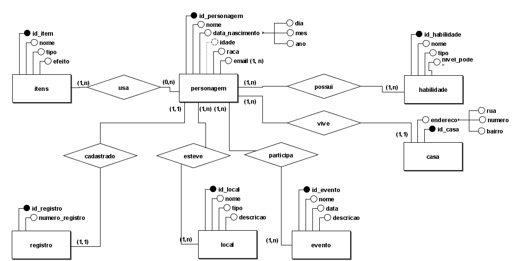

# 1 - Cenário

No universo de "Slime Datta Ken", é necessário um sistema de banco de dados para gerenciar as diversas entidades e suas relações. O sistema visa organizar informações sobre os personagens, habilidades, itens, locais e eventos, fundamentais para a administração do mundo em que vivem. As entidades principais são:

Um personagem possui várias habilidades, vários itens, participa de muitos e ventos e ja esteve em muitos locais

Personagem: representa cada ser vivo, contendo atributos como nome, idade, raça e habilidades.

Habilidade: habilidades ou poderes que um personagem pode possuir, incluindo nome, tipo e nível de poder.

Item: objetos que os personagens podem usar, com atributos como nome, tipo e efeito.

Local: locais dentro do universo, como cidades, florestas e masmorras, com atributos como nome, tipo e descrição.

Evento: eventos importantes que ocorrem no universo, com atributos como nome, data e descrição.

# 2 - Modelagem Conceitual


# 3 - Modelagem Lógica


# 4 - Modelagem Física
```sql
CREATE TABLE Personagem (
  id_personagem INT PRIMARY KEY,
  nome VARCHAR(100),
  data_nascimento DATE,
  idade INT GENERATED ALWAYS AS (YEAR(CURDATE()) - YEAR(data_nascimento)) STORED,
  raca VARCHAR(100)
);

CREATE TABLE Habilidade (
  id_habilidade INT PRIMARY KEY,
  nome VARCHAR(100),
  tipo VARCHAR(100),
  nivel_poder INT
);

CREATE TABLE Item (
  id_item INT PRIMARY KEY,
  nome VARCHAR(100),
  tipo VARCHAR(100),
  efeito VARCHAR(255)
);

CREATE TABLE Local (
  id_local INT PRIMARY KEY,
  nome VARCHAR(100),
  tipo VARCHAR(100),
  descricao VARCHAR(255)
);

CREATE TABLE Evento (
  id_evento INT PRIMARY KEY,
  nome VARCHAR(100),
  data DATE,
  descricao VARCHAR(255)
);

CREATE TABLE Personagem_Habilidade (
  id_personagem INT,
  id_habilidade INT,
  FOREIGN KEY (id_personagem) REFERENCES Personagem(id_personagem),
  FOREIGN KEY (id_habilidade) REFERENCES Habilidade(id_habilidade)
);

CREATE TABLE Personagem_Item (
  id_personagem INT,
  id_item INT,
  FOREIGN KEY (id_personagem) REFERENCES Personagem(id_personagem),
  FOREIGN KEY (id_item) REFERENCES Item(id_item)
);

CREATE TABLE Personagem_Local (
  id_personagem INT,
  id_local INT,
  FOREIGN KEY (id_personagem) REFERENCES Personagem(id_personagem),
  FOREIGN KEY (id_local) REFERENCES Local(id_local)
);

CREATE TABLE Personagem_Evento (
  id_personagem INT,
  id_evento INT,
  FOREIGN KEY (id_personagem) REFERENCES Personagem(id_personagem),
  FOREIGN KEY (id_evento) REFERENCES Evento(id_evento)
);
```

# 5 - Inserção de Dados
```sql
-- Inserindo dados na tabela Personagem
INSERT INTO Personagem (id_personagem, nome, data_nascimento, raca) VALUES
(1, 'Rimuru Tempest', '1720-01-01', 'Slime'),
(2, 'Shizu', '1995-05-10', 'Humana'),
(3, 'Benimaru', '1998-02-14', 'Oni'),
(4, 'Shion', '1997-03-12', 'Oni'),
(5, 'Gobta', '2001-05-01', 'Goblin'),
(6, 'Ranga', '2000-06-18', 'Lobo Tempest'),
(7, 'Souei', '1996-07-21', 'Oni'),
(8, 'Hakurou', '1945-08-19', 'Oni'),
(9, 'Milim Nava', '1500-09-01', 'Dragonoid'),
(10, 'Diablo', '1700-10-10', 'Demônio'),
(11, 'Geld', '1985-11-25', 'Orc'),
(12, 'Treyni', '1800-12-15', 'Dryad'),
(13, 'Garm', '1992-01-17', 'Dwarf'),
(14, 'Kaijin', '1989-02-28', 'Dwarf'),
(15, 'Vesta', '1990-03-03', 'Dwarf'),
(16, 'Rigurd', '1950-04-04', 'Goblin'),
(17, 'Beretta', '1750-05-05', 'Homúnculo'),
(18, 'Gabil', '1980-06-06', 'Dragonewt'),
(19, 'Albis', '1994-07-07', 'Snake'),
(20, 'Phobio', '1995-08-08', 'Beastman');

-- Inserindo dados na tabela Habilidade
INSERT INTO Habilidade (id_habilidade, nome, tipo, nivel_poder) VALUES
(1, 'Predator', 'Ataque', 10),
(2, 'Great Sage', 'Suporte', 9),
(3, 'Black Lightning', 'Ataque', 8),
(4, 'Megiddo', 'Ataque', 10),
(5, 'Clairvoyance', 'Suporte', 7),
(6, 'Dragon Power', 'Ataque', 10),
(7, 'Demon Lord\'s Haki', 'Ataque', 9),
(8, 'Healing', 'Suporte', 6),
(9, 'Water Blade', 'Ataque', 7),
(10, 'Shadow Motion', 'Ataque', 8);

-- Inserindo dados na tabela Item
INSERT INTO Item (id_item, nome, tipo, efeito) VALUES
(1, 'Potion', 'Cura', 'Recupera HP'),
(2, 'Magic Sword', 'Ataque', 'Aumenta dano'),
(3, 'Shield', 'Defesa', 'Aumenta defesa'),
(4, 'Mana Potion', 'Cura', 'Recupera MP'),
(5, 'Fire Scroll', 'Ataque', 'Lança uma bola de fogo'),
(6, 'Ice Amulet', 'Defesa', 'Resiste ao gelo'),
(7, 'Ring of Strength', 'Ataque', 'Aumenta força'),
(8, 'Elixir of Life', 'Cura', 'Recupera completamente HP e MP'),
(9, 'Stealth Cloak', 'Suporte', 'Torna invisível por um tempo'),
(10, 'Boots of Speed', 'Suporte', 'Aumenta a velocidade de movimento');

-- Inserindo dados na tabela Local
INSERT INTO Local (id_local, nome, tipo, descricao) VALUES
(1, 'Tempest', 'Cidade', 'Cidade principal dos monstros'),
(2, 'Floresta Jura', 'Floresta', 'Grande floresta onde Rimuru chegou'),
(3, 'Dwargon', 'Cidade', 'Cidade dos anões'),
(4, 'Farmenas', 'Cidade', 'Reino dos humanos'),
(5, 'Caverna dos Espíritos', 'Caverna', 'Lar dos espíritos elementais'),
(6, 'Vulcão Magma', 'Vulcão', 'Vulcão ativo onde vivem os Ifrits'),
(7, 'Lago Azul', 'Lago', 'Lago de águas cristalinas'),
(8, 'Vale Sombrio', 'Vale', 'Vale onde a luz do sol raramente chega'),
(9, 'Montanha Nebulosa', 'Montanha', 'Montanha coberta de neblina'),
(10, 'Ruínas Antigas', 'Ruínas', 'Ruínas de uma antiga civilização');

-- Inserindo dados na tabela Evento
INSERT INTO Evento (id_evento, nome, data, descricao) VALUES
(1, 'Fundação de Tempest', '2020-01-01', 'Fundação da cidade de Tempest'),
(2, 'Batalha contra Orc Lord', '2020-06-01', 'Grande batalha contra Orc Lord'),
(3, 'Confronto com Charybdis', '2021-02-15', 'Batalha contra o monstro Charybdis'),
(4, 'Invasão de Clayman', '2021-07-20', 'Invasão liderada pelo Lorde Demônio Clayman'),
(5, 'Aliança com Dwargon', '2019-12-01', 'Formação de uma aliança com o reino dos anões'),
(6, 'Festival de Tempest', '2021-09-10', 'Primeiro festival da cidade de Tempest'),
(7, 'Encontro com Milim', '2020-03-05', 'Primeiro encontro com a Lorde Demônio Milim Nava'),
(8, 'Aparição de Veldora', '2022-01-01', 'Libertação do dragão Veldora'),
(9, 'Conquista de Farmenas', '2021-05-25', 'Conquista do reino de Farmenas'),
(10, 'Derrota de Hinata', '2021-11-11', 'Batalha e derrota de Hinata Sakaguchi');

-- Inserindo dados na tabela Personagem_Habilidade
INSERT INTO Personagem_Habilidade (id_personagem, id_habilidade) VALUES
(1, 1),
(1, 2),
(2, 2),
(3, 3),
(4, 4),
(5, 5),
(6, 6),
(7, 7),
(8, 8),
(9, 6),
(10, 7),
(11, 9),
(12, 10),
(13, 9),
(14, 10),
(15, 8),
(16, 5),
(17, 3),
(18, 4),
(19, 2),
(20, 1);

-- Inserindo dados na tabela Personagem_Item
INSERT INTO Personagem_Item (id_personagem, id_item) VALUES
(1, 1),
(1, 2),
(2, 1),
(3, 3),
(4, 4),
(5, 5),
(6, 6),
(7, 7),
(8, 8),
(9, 9),
(10, 10),
(11, 1),
(12, 2),
(13, 3),
(14, 4),
(15, 5),
(16, 6),
(17, 7),
(18, 8),
(19, 9),
(20, 10);

-- Inserindo dados na tabela Personagem_Local
INSERT INTO Personagem_Local (id_personagem, id_local) VALUES
(1, 1),
(1, 2),
(2, 2),
(3, 3),
(4, 4),
(5, 5),
(6, 6),
(7, 7),
(8, 8),
(9, 9),
(10, 10),
(11, 1),
(12, 2),
(13, 3),
(14, 4),
(15, 5),
(16, 6),
(17, 7),
(18, 8),
(19, 9),
(20, 10);

-- Inserindo dados na tabela Personagem_Evento
INSERT INTO Personagem_Evento (id_personagem, id_evento) VALUES
(1, 1),
(1, 2),
(2, 2),
(3, 3),
(4, 4),
(5, 5),
(6, 6),
(7, 7),
(8, 8),
(9, 9),
(10, 10),
(11, 1),
(12, 2),
(13, 3),
(14, 4),
(15, 5),
(16, 6),
(17, 7),
(18, 8),
(19, 9),
(20, 10);
```

# 6 - CRUD
### Create
```sql
INSERT INTO Personagem (id_personagem, nome, data_nascimento, raca) VALUES (3, 'Benimaru', '1998-02-14', 'Oni');
```

### Read
```sql
SELECT * FROM Personagem WHERE nome = 'Rimuru Tempest';
```

### Update
```sql
UPDATE Personagem SET raca = 'Demônio' WHERE nome = 'Rimuru Tempest';
```

### Delete
```sql
DELETE FROM Personagem WHERE nome = 'Shizu';
```
